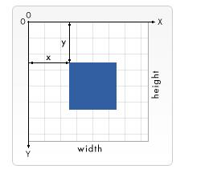

### 网格
- 坐标系  

```html
<!--
1个用户单位等同于1个屏幕单位(只需给出数字，不标明单位)
这里定义的画布尺寸是200*200px。
但是，viewBox属性定义了画布上可以显示的区域：从(0,0)点开始，100宽*100高的区域。
这个100*100的区域，会放到200*200的画布上显示。于是就形成了放大两倍的效果。
-->
<svg width="200" height="200" viewBox="0 0 100 100"></svg>
```

##### 通过viewBox对图形进行放缩的意义很大,免去图形尺寸变化导致重绘图形的问题

