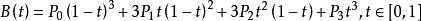
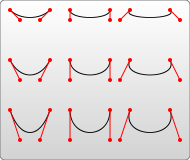
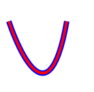
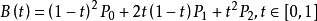
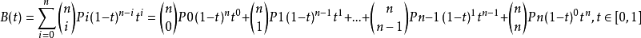

### 路径
> 大写是绝对坐标, 小写是相对坐标
- 直线命令
  - Move to
    ```
      M x y
      m dx dy
    ```
  - Line to
    ```
    L x y (or l dx dy) // line to
    H x (or h dx) // 水平
    V y (or v dy) // 垂直
    Z (or z) // 闭合
    ```
- 曲线命令
  - 三次贝塞尔曲线 **C**  
    
    ```markdown
      B(t) = P0*(1-t)³ + 3*P1*t*(1-t)² + 3*P2*t²*(1-t) + P3*t³
    ```
    ```
    // (x1,y1)是起点的控制点，
    // (x2,y2)是终点的控制点
    // 最后一个坐标(x,y)表示的是曲线的终点
    C x1 y1, x2 y2, x y 
    c dx1 dy1, dx2 dy2, dx dy
    ```
    ##### 例子
    > 图例上的曲线从左往右看，控制点在水平方向上逐渐分开;  
      图例上的曲线从右往左看，控制点之间离得越来越远。  
      这里要注意观察，曲线沿着起点到第一控制点的方向伸出，逐渐弯曲，
      然后沿着第二控制点到终点的方向结束。
    
    
    
  - 三次贝塞尔曲线 **S**
    > 如果S命令跟在一个C或S命令后面，则它的第一个控制点会被假设成前一个命令曲线的第二个控制点的中心对称点。
    
    > 下面是S命令的语法示例，图中左侧红色标记的点对应的控制点即为蓝色标记点。
    ```
    S x2 y2, x y 
    s dx2 dy2, dx dy
    ```
    ```html
      <svg width="190px" height="160px" version="1.1" xmlns="http://www.w3.org/2000/svg">
       <!-- 等效命令-->
       <path d="M10 80 C 40 10, 65 10, 95 80 C 125 150, 150 150, 180 80" stroke="black" fill="transparent"></path>
        <path d="M10 80 C 40 10, 65 10, 95 80 S 150 150, 180 80" stroke="black" fill="transparent"/>
      </svg>
    ```
    
    
   > 下面的这两条代码是等效的;如果S命令单独使用，前面没有C或S命令，那  
     当前点将作为第一个控制点。
   ```html
    <!-- C命令和S命令的对比-->
    <path d="M 195 80 C 195 80, 250 250, 280 80" stroke="#00f" stroke-width="8" fill="transparent"></path>
    <path d="M 195 80 S 250 250, 280 80" stroke="#f00" stroke-width="4" fill="transparent"></path>
   ```
   
   
  - 二次贝塞尔曲线 **Q**  
  
  ```
  B(t) = P0*(1-t)² + P1*2*t*(1-t) + P2*t²
  ```
  ```
  Q x1 y1, x y
  q dx1 dy1, dx dy
  ```
  ```html
   <path d="M10 80 Q 95 10 180 80" stroke="black" fill="transparent"/>
  ```
  
  - 二次贝塞尔曲线 **T**  
  > 在你的第一个控制点后面，可以只定义终点，就创建出一个相当复杂的曲线  
  > T命令前面必须是一个Q命令，或者是另一个T命令，才能达到这种效果。  
  > 如果T单独使用，那么控制点就会被认为和终点是同一个点，所以画出来的将是一条直线。
  ```html
    <path d="M10 80 Q 52.5 10, 95 80 T 180 80" stroke="black" fill="transparent"/>
  ```
  
  > 给定点P0、P1、…、Pn，其贝兹曲线即  
  > 
  
  - 弧形 Arcs
  ```
    // rx ry: 长短半径, 
    // x-axis-rotation: x轴转动角度(deg), 
    // large-arc-flag: 决定弧线是大于还是小于180度，0表示小角度弧，1表示大角度弧
    // sweep-flag表示弧线的方向，0表示从起点到终点沿逆时针画弧，1表示从起点到终点沿顺时针画弧
    // x y: 结束点
    A rx ry x-axis-rotation large-arc-flag sweep-flag x y
    a rx ry x-axis-rotation large-arc-flag sweep-flag dx dy
  ```
  ```html
    <svg width="325px" height="325px" version="1.1" xmlns="http://www.w3.org/2000/svg">
      <path d="M80 80
               A 45 45, 0, 0, 0, 125 125
               L 125 80 Z" fill="green"/>
      <path d="M230 80
               A 45 45, 0, 1, 0, 275 125
               L 275 80 Z" fill="red"/>
      <path d="M80 230
               A 45 45, 0, 0, 1, 125 275
               L 125 230 Z" fill="purple"/>
      <path d="M230 230
               A 45 45, 0, 1, 1, 275 275
               L 275 230 Z" fill="blue"/>
    </svg>
  ```
  
  
  
  
