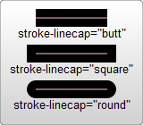
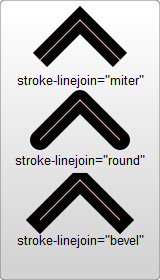
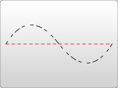
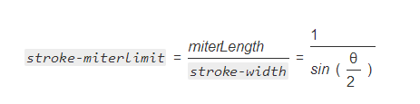

### 填充和边框

#### 上色
- fill 填充颜色
- fill-opacity 填充透明度
- stroke 描边上色
- stroke-opacity 描边透明度
```html
<rect x="10" y="10" width="100" height="100" 
      stroke="blue" 
      stroke-opacity="0.8"
      fill="purple"
      fill-opacity="0.5"/>
```

#### 描边
描边的三个属性
- stroke 描边的颜色  
- stroke-width 边的宽度  
  > 描边是以路径为中心线绘制的
- stroke-linecap 控制边框终点的形状  
  值:butt(默认) | square(大一点的方形) | round(圆角)   
  ```html
    <svg width="160" height="140" xmlns="http://www.w3.org/2000/svg" version="1.1">
      <line x1="40" x2="120" y1="20" y2="20" stroke="black" 
            stroke-width="20" stroke-linecap="butt"/>
      <line x1="40" x2="120" y1="60" y2="60" stroke="black" 
            stroke-width="20" stroke-linecap="square"/>
      <line x1="40" x2="120" y1="100" y2="100" stroke="black" 
            stroke-width="20" stroke-linecap="round"/>
    </svg>
  ```
   
  
- stroke-linejoin 控制两条描边线段之间，用什么方式连接  
  值: miter(尖) | round(圆) | bevel(倒角？)  
  ```html
    <svg width="160" height="280" xmlns="http://www.w3.org/2000/svg" version="1.1">
      <polyline points="40 60 80 20 120 60" 
                stroke="black" 
                stroke-width="20"
                stroke-linecap="butt"  
                stroke-linejoin="miter" 
                fill="none"/>
      
      <polyline points="40 140 80 100 120 140" 
                stroke="black" 
                stroke-width="20"
                stroke-linecap="round" 
                stroke-linejoin="round"
                fill="none" />
      
      <polyline points="40 220 80 180 120 220" 
                stroke="black" 
                stroke-width="20"
                stroke-linecap="square" 
                stroke-linejoin="bevel"
                fill="none" />
    </svg>
  ```  
  
  
- stroke-dasharray  
  > - 参数是一组用逗号分割的数字组成的数列
  > - 和path不一样，这里的数字必须用逗号分割（空格会被忽略）
  > - 每一组数字，第一个用来表示填色区域的长度，第二个用来表示非填色区域的长度
  ```html
    <svg width="200" height="150" xmlns="http://www.w3.org/2000/svg" version="1.1">
      <path d="M 10 75 Q 50 10 100 75 T 190 75" 
            stroke="black"
            stroke-linecap="round" 
            stroke-dasharray="5,10,5" 
            fill="none"/>
      <path d="M 10 75 L 190 75" 
            stroke="red"
            stroke-linecap="round" 
            stroke-width="1" 
            stroke-dasharray="5,5" 
            fill="none"/>
    </svg>
  ```
  
  
- fill-rule 用于定义如何给图形重叠的区域上色  
  > 某点属于该形状的“内部”还是“外部”
  > - 从点向任意方向的无限远处绘制射线，然后检测形状与射线相交的位置。
      开始于0数，射线上每次从左向右相交就加1，每次从右向左相交就减1。
      数一下相交次数，如果结果是0，点就在路径外面，否则认为，点在路径里面。
  > - 从点向任意方向的无限远处绘制射线，并数一数给定形状与射线相交的路径段的数目，
      如果数目是奇数的，点在内部，如果数目是偶数的，点在外部。

- stroke-miterlimit 定义什么情况下绘制或不绘制边框连接的miter效果
  > 如果两条线交汇在一起形成一个尖角，而且属性stroke-linejoin指定了miter，  
  > 斜接有可能扩展到远远超过出路径轮廓线的线宽。属性stroke-miterlimit  
  > 对斜接长度和stroke-width的比率强加了一个极限。当极限到达时，交汇处由斜接变成倒角。
  
  - 线条夹角的一半有关系  
  
  
- stroke-dashoffset 定义虚线开始的位置
  ```html
    <!-- stroke-dashoffset: 向左----正数; 向右----负数  -->
    <!--  百分比 表示当前 viewport的百分比 -->
    <line x1="10" y1="175" x2="380" y2="175" stroke="#000" 
          stroke-width="2" 
          stroke-dasharray="10,5" 
          stroke-dashoffset="322%"></line>
  ```
  
#### 使用CSS
> SVG规范将属性区分成properties和其他attributes，
  前者是可以用CSS设置的，后者不能。
#### 显示属性
```
 alignment-baseline, 
 baseline-shift, 
 clip, 
 clip-path, 
 clip-rule, 
 
 color, color-interpolation, color-interpolation-filters, 
 color-profile, color-rendering, 
 
 cursor, 
 direction, 
 display, 
 dominant-baseline, 
 enable-background, 
 
 fill, fill-opacity, fill-rule, 
 
 filter, 
 
 flood-color, 
 flood-opacity, 
 
 font-family, font-size, font-size-adjust, font-stretch, font-style, 
 font-variant, font-weight, 
 
 glyph-orientation-horizontal, 
 glyph-orientation-vertical,
 
 
 image-rendering, 
 kerning, 
 
 letter-spacing, 
 
 lighting-color, 
 marker-end, 
 marker-mid, 
 marker-start, 
 mask, 
 opacity, 
 overflow, 
 pointer-events, 
 shape-rendering, 
 
 stop-color, 
 stop-opacity, 
 
 stroke, 
 stroke-dasharray, 
 stroke-dashoffset,
 stroke-linecap, 
 stroke-linejoin, 
 stroke-miterlimit, 
 stroke-opacity, 
 stroke-width, 
 
 text-anchor, 
 transform, 
 
 text-decoration, 
 text-rendering, 
 unicode-bidi, 
 vector-effect, 
 visibility, 
 word-spacing, 
 
 writing-mode
```