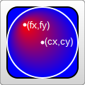
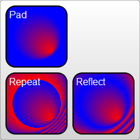

### 渐变
--- 为了让渐变能被重复使用，渐变内容需要定义在\<defs>标签内部

#### 线性渐变 Linear Gradient
- \<linearGradient/> 的属性
  - gradientUnits : **userSpaceOnUse|objectBoundingBox(default)**
  - gradientTransform : rotate(角度) translate(left,top) 都不用加单位
  - spreadMethod : **pad | reflect | repeat**
  - href : 引用 可以不用重复定义stop元素
  - x1,y1 : 渐变起点 百分比 或者 0~1 的数字
  - x2,y2 : 渐变终点 
  
    ```html
    <defs>
     <linearGradient id="gradient-38aa76" 
                     gradientTransform="rotate(45)" 
                     gradientUnits="objectBoundingBox" 
                     spreadMethod="repeat" 
                     x1="0" 
                     y1="50%" 
                     x2="100%" 
                     y2="50%">
        <stop stop-color="#f00" stop-opacity="1" offset="0"></stop>
        <stop stop-color="#0f0" stop-opacity="0.2" offset="0.5"></stop>
        <stop stop-color="#00f" stop-opacity="1" offset="1"></stop>
      </linearGradient>
    </defs>
    ```
    
    ```html
    <svg viewBox="0 0 10 10" xmlns="http://www.w3.org/2000/svg"
         xmlns:xlink="http://www.w3.org/1999/xlink">
      <defs>
        <linearGradient id="myGradient" gradientTransform="rotate(90)">
          <stop offset="5%"  stop-color="gold" />
          <stop offset="95%" stop-color="red" />
        </linearGradient>
      </defs>
     
      <!-- using my linear gradient -->
      <circle cx="5" cy="5" r="4" fill="url('#myGradient')" />
    </svg>
    ```
- \<stop> 的属性
  - offset : number | percentage  `0~1 0%~100%`
  - stop-color : 分段颜色
  - stop-opacity : default = 1
  ```html
    <stop offset="100%" stop-color="yellow" stop-opacity="0.5"/>
  ```

#### 径向渐变

- \<radialGradient> 的属性
  - cx,cy,r : 渐变中心 + 半径 `0~1 或者 百分比`
  - fx,fy,fr : 焦点中心 + 半径 `0~1 或者 百分比`
  - gradientUnits 同上
  - gradientTransform 同上
  - spreadMethod 同上
  - href : 引用
  ```html
    <svg width="120" height="120" version="1.1"
      xmlns="http://www.w3.org/2000/svg">
      <defs>
          <radialGradient id="Gradient"
                cx="0.5" cy="0.5" r="0.5" fx="0.25" fy="0.25">
            <stop offset="0%" stop-color="red"/>
            <stop offset="100%" stop-color="blue"/>
          </radialGradient>
      </defs>
     
      <rect x="10" y="10" rx="15" ry="15" width="100" height="100"
            fill="url(#Gradient)" stroke="black" stroke-width="2"/>
    
      <circle cx="60" cy="60" r="50" 
              fill="transparent" stroke="white" stroke-width="2"/>
      <circle cx="35" cy="35" r="2" fill="white" stroke="white"/>
      <circle cx="60" cy="60" r="2" fill="white" stroke="white"/>
      <text x="38" y="40" fill="white" font-family="sans-serif" 
            font-size="10pt">(fx,fy)</text>
      <text x="63" y="63" fill="white" font-family="sans-serif" 
            font-size="10pt">(cx,cy)</text>
    </svg>
  ```
  
  

