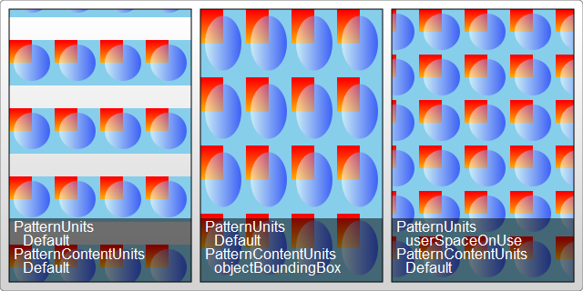

### Patterns?? 模式??
- 先来一段代码
  ```html
    <svg width="200" height="200" xmlns="http://www.w3.org/2000/svg">
      <defs>
        <linearGradient id="Gradient1">
          <stop offset="5%" stop-color="white"/>
          <stop offset="95%" stop-color="blue"/>
        </linearGradient>
        <linearGradient id="Gradient2" x1="0" x2="0" y1="0" y2="1">
          <stop offset="5%" stop-color="red"/>
          <stop offset="95%" stop-color="orange"/>
        </linearGradient>
    
        <pattern id="Pattern" x="0" y="0" width=".25" height=".25">
          <rect x="0" y="0" width="50" height="50" fill="skyblue"/>
          <rect x="0" y="0" width="25" height="25" fill="url(#Gradient2)"/>
          <circle cx="25" cy="25" r="20" fill="url(#Gradient1)" fill-opacity="0.5"/>
        </pattern>
      </defs>
    
      <rect fill="url(#Pattern)" stroke="black" width="200" height="200"/>
    </svg>
  ```
 
- pattern 标签
  - width height : 描述在重复下一个图案之前应该跨过多远 `0 ~ 1` or `0% ~ 100%`
  - x y : 绘制时偏移矩形的开始点 `0 ~ 1` or `0% ~ 100%`
  - href : 
  - patternContentUnits  userSpaceOnUse (default) | objectBoundingBox  
    - 描述了pattern元素的坐标系统
    - userSpaceOnUse 用户的系统-global ==> 基于父元素的坐标体系
    - objectBoundingBox 自己的系统-self ===> 基于自己的坐标系
  - patternUnits  userSpaceOnUse | objectBoundingBox (default)
    - pattern属性元素的坐标系统
    - 配置项值的意思与上文一致
  - patternTransform 参考前面的描述 
  - preserveAspectRatio
  - viewBox  
  
  ##### 关于patternContentUnits和patternUnits
  

