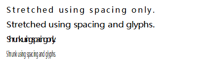
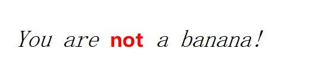
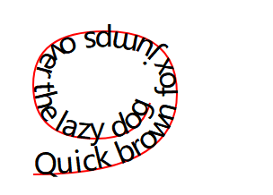

### Texts

##### text   
- 属性
  - x,y 文本基线起点
  - dx,dy 相对于偏移的位置
  - rotate 每一个文字都会旋转
  - lengthAdjust spacing(default 文字分散摆放)|spacingAndGlyphs 文字拉伸铺满
  - textLength 数值 百分比 none(default)
  ```html
    <svg width="300" height="150" xmlns="http://www.w3.org/2000/svg">
      <g font-face="sans-serif">
        <text x="0" y="20" textLength="300" lengthAdjust="spacing">
          Stretched using spacing only.
        </text>
        <text x="0" y="50" textLength="300" lengthAdjust="spacingAndGlyphs">
          Stretched using spacing and glyphs.
        </text>
        <text x="0" y="80" textLength="100" lengthAdjust="spacing">
          Shrunk using spacing only.
        </text>
        <text x="0" y="110" textLength="100" lengthAdjust="spacingAndGlyphs">
          Shrunk using spacing and glyphs.
        </text>
      </g>
    </svg>
  ```
  
  
  
- 可以做属性也可以css的属性
  - font-family
  - font-style
  - font-weight
  - font-variant
  - font-stretch
  - font-size
  - font-size-adjust
  - kerning
  - letter-spacing
  - word-spacing
  - text-decoration
  
##### tspan
- 属性 与text相同
  > tspan的属性会覆盖父元素text的属性
  ```html
    <svg viewBox="0 0 240 40" xmlns="http://www.w3.org/2000/svg">
      <style>
        text  { font: italic 12px serif; }
        tspan { font: bold 10px sans-serif; fill: red; }
      </style>
    
      <text x="10" y="30" class="small">
        You are
        <tspan>not</tspan>
        a banana!
      </text>
    </svg>
  ```
  
  
##### textPath
- 属性
  - href 要呈现文本的路径或基本形状的URL
  - lengthAdjust spacing|spacingAndGlyphs
  - textLength 
  - ~~method~~ align|stretch
  - ~~path~~ 测试后发现只有Firefox支持(路径path)
  - ~~side~~ 测试后发现只有Firefox支持 left|right 
  - ~~spacing~~
  - startOffset 数字 百分比 

```html
<!-- to hide the path, it is usually wrapped in a <defs> element -->
  <!-- <defs> -->
  <path id="MyPath" fill="none" stroke="red"
        d="M10,90 Q90,90 90,45 Q90,10 50,10 Q10,10 10,40 Q10,70 45,70 Q70,70 75,50" />
  <!-- </defs> -->

  <text>
    <textPath href="#MyPath">
      Quick brown fox jumps over the lazy dog.
    </textPath>
  </text>
```

