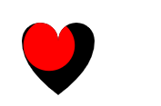
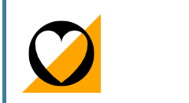

### 裁剪和遮罩

#### 裁剪 clipPath
- clipPathUnits
  - userSpaceOnUse | objectBoundingBox
```html
<svg viewBox="0 0 100 100">
  <clipPath id="myClip">
    <!--
      Everything outside the circle will be
      clipped and therefore invisible.
    -->
    <circle cx="40" cy="35" r="35" />
  </clipPath>
 
  <!-- The original black heart, for reference -->
  <path id="heart" d="M10,30 A20,20,0,0,1,50,30 A20,20,0,0,1,90,30 Q90,60,50,90 Q10,60,10,30 Z" />
 
  <!--
    Only the portion of the red heart
    inside the clip circle is visible.
  -->
  <use clip-path="url(#myClip)" xlink:href="#heart" fill="red" />
</svg>
```


#### 遮罩mask
- width height 120%(default)
- x y -10% (default)
- maskUnits : userSpaceOnUse | objectBoundingBox(default)
- maskContentUnits : userSpaceOnUse(default) | objectBoundingBox
```html
<svg viewBox="-10 -10 120 120">
  <mask id="myMask">
    <!-- Everything under a white pixel will be visible -->
    <rect x="0" y="0" width="100" height="100" fill="white" />

    <!-- Everything under a black pixel will be invisible -->
    <path d="M10,35 A20,20,0,0,1,50,35 A20,20,0,0,1,90,35 Q90,65,50,95 Q10,65,10,35 Z" fill="black" />
  </mask>
 
  <polygon points="-10,110 110,110 110,-10" fill="orange" />

  <!-- with this mask applied, we "punch" a heart shape hole into the circle -->
  <circle cx="50" cy="50" r="50" mask="url(#myMask)" />
</svg>
```

