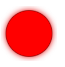

### 滤镜
- filter
  - x y 
  - width height
  - filterRes
  - filterUnits userSpaceOnUse | objectBoundingBox(default)
  - primitiveUnits userSpaceOnUse(default) | objectBoundingBox
  - href
  
- feGaussianBlur 高斯模糊
  - in SourceGraphic???
  - stdDeviation 模糊的宽度???
  - edgeMode duplicate(default) | wrap | none
  
- feOffset 对输入的图像进行偏移
  - in SourceGraphic???
  - dx
  - dy

- feSpecularLighting 
  > 该滤镜制作了一个图像，图像包含光照计算的镜面反射部分
  > 算术<feComposite>方法的叠加
  - in SourceGraphic???
  - lighting-color
  - surfaceScale 表示滤光器基元的曲面高度
  - specularConstant 控制反射光的反射比
  - specularExponent 控制光源的焦点
  - ~~kernelUnitLength~~ 已弃用
  
- fePointLight 点光源滤镜
  - x 光源相对于svg的位置
  - y
  - z 远离屏幕越大
  
- feComposite 
  > 无法描述,用到时再说吧
  > 该滤镜执行两个输入图像的智能像素组合  
  - in 标识给定过滤器原语的输入  
    ```markdown
    SourceGraphic | SourceAlpha | BackgroundImage | BackgroundAlpha | 
    FillPaint | StrokePaint | <filter-primitive-reference>
    ```
  - in2 标识给定过滤器原语的输入 
    ```markdown
    SourceGraphic | SourceAlpha | BackgroundImage | BackgroundAlpha | 
    FillPaint | StrokePaint | <filter-primitive-reference>
    ```
  - operator 运算符属性基于其使用的上下文的两个含义。它定义要执行的合成或变形操作。
    ```over | in | out | atop | xor | lighter | arithmetic```
  - k1 k2 k3 k4 
    ```markdown
    如果选择了arithmetic操作，每个结果像素都要经过下面的方程式的计算  
    `result = k1*i1*i2 + k2*i1 + k3*i2 + k4`
    ```
  ```html
    <svg width="330" height="195" viewBox="0 0 1100 650" version="1.1"
         xmlns="http://www.w3.org/2000/svg" xmlns:xlink="http://www.w3.org/1999/xlink">
      <title>Example feComposite - Examples of feComposite operations</title>
      <desc>Four rows of six pairs of overlapping triangles depicting
            the six different feComposite operators under different
            opacity values and different clearing of the background.</desc>
    	<defs>
        <desc>Define two sets of six filters for each of the six compositing operators.
              The first set wipes out the background image by flooding with opaque white.
              The second set does not wipe out the background, with the result
              that the background sometimes shines through and is other cases
              is blended into itself (i.e., "double-counting").</desc>
        <filter id="overFlood" filterUnits="objectBoundingBox" x="-5%" y="-5%" width="110%" height="110%">
          <feFlood flood-color="#ffffff" flood-opacity="1" result="flood"/>
          <feComposite in="SourceGraphic" in2="BackgroundImage" operator="over" result="comp"/>
          <feMerge> <feMergeNode in="flood"/> <feMergeNode in="comp"/> </feMerge>
        </filter>
        <filter id="inFlood" filterUnits="objectBoundingBox" x="-5%" y="-5%" width="110%" height="110%">
          <feFlood flood-color="#ffffff" flood-opacity="1" result="flood"/>
          <feComposite in="SourceGraphic" in2="BackgroundImage" operator="in" result="comp"/>
          <feMerge> <feMergeNode in="flood"/> <feMergeNode in="comp"/> </feMerge>
        </filter>
        <filter id="outFlood" filterUnits="objectBoundingBox" x="-5%" y="-5%" width="110%" height="110%">
          <feFlood flood-color="#ffffff" flood-opacity="1" result="flood"/>
          <feComposite in="SourceGraphic" in2="BackgroundImage" operator="out" result="comp"/>
          <feMerge> <feMergeNode in="flood"/> <feMergeNode in="comp"/> </feMerge>
        </filter>
        <filter id="atopFlood" filterUnits="objectBoundingBox" x="-5%" y="-5%" width="110%" height="110%">
          <feFlood flood-color="#ffffff" flood-opacity="1" result="flood"/>
          <feComposite in="SourceGraphic" in2="BackgroundImage" operator="atop" result="comp"/>
          <feMerge> <feMergeNode in="flood"/> <feMergeNode in="comp"/> </feMerge>
        </filter>
        <filter id="xorFlood" filterUnits="objectBoundingBox" x="-5%" y="-5%" width="110%" height="110%">
          <feFlood flood-color="#ffffff" flood-opacity="1" result="flood"/>
          <feComposite in="SourceGraphic" in2="BackgroundImage" operator="xor" result="comp"/>
          <feMerge> <feMergeNode in="flood"/> <feMergeNode in="comp"/> </feMerge>
        </filter>
        <filter id="arithmeticFlood" filterUnits="objectBoundingBox" 
                x="-5%" y="-5%" width="110%" height="110%">
          <feFlood flood-color="#ffffff" flood-opacity="1" result="flood"/>
          <feComposite in="SourceGraphic" in2="BackgroundImage" result="comp"
                       operator="arithmetic" k1=".5" k2=".5" k3=".5" k4=".5"/>
          <feMerge> <feMergeNode in="flood"/> <feMergeNode in="comp"/> </feMerge>
        </filter>
        <filter id="overNoFlood" filterUnits="objectBoundingBox" x="-5%" y="-5%" width="110%" height="110%">
          <feComposite in="SourceGraphic" in2="BackgroundImage" operator="over" result="comp"/>
        </filter>
        <filter id="inNoFlood" filterUnits="objectBoundingBox" x="-5%" y="-5%" width="110%" height="110%">
          <feComposite in="SourceGraphic" in2="BackgroundImage" operator="in" result="comp"/>
        </filter>
        <filter id="outNoFlood" filterUnits="objectBoundingBox" x="-5%" y="-5%" width="110%" height="110%">
          <feComposite in="SourceGraphic" in2="BackgroundImage" operator="out" result="comp"/>
        </filter>
        <filter id="atopNoFlood" filterUnits="objectBoundingBox" x="-5%" y="-5%" width="110%" height="110%">
          <feComposite in="SourceGraphic" in2="BackgroundImage" operator="atop" result="comp"/>
        </filter>
        <filter id="xorNoFlood" filterUnits="objectBoundingBox" x="-5%" y="-5%" width="110%" height="110%">
          <feComposite in="SourceGraphic" in2="BackgroundImage" operator="xor" result="comp"/>
        </filter>
        <filter id="arithmeticNoFlood" filterUnits="objectBoundingBox" 
                x="-5%" y="-5%" width="110%" height="110%">
          <feComposite in="SourceGraphic" in2="BackgroundImage" result="comp"
                       operator="arithmetic" k1=".5" k2=".5" k3=".5" k4=".5"/>
        </filter>
        <path id="Blue100" d="M 0 0 L 100 0 L 100 100 z" fill="#00ffff" />
        <path id="Red100" d="M 0 0 L 0 100 L 100 0 z" fill="#ff00ff" />
        <path id="Blue50" d="M 0 125 L 100 125 L 100 225 z" fill="#00ffff" fill-opacity=".5" />
        <path id="Red50" d="M 0 125 L 0 225 L 100 125 z" fill="#ff00ff" fill-opacity=".5" />
        <g id="TwoBlueTriangles">
          <use xlink:href="#Blue100"/>
          <use xlink:href="#Blue50"/>
        </g>
        <g id="BlueTriangles">
          <use transform="translate(275,25)" xlink:href="#TwoBlueTriangles"/>
          <use transform="translate(400,25)" xlink:href="#TwoBlueTriangles"/>
          <use transform="translate(525,25)" xlink:href="#TwoBlueTriangles"/>
          <use transform="translate(650,25)" xlink:href="#TwoBlueTriangles"/>
          <use transform="translate(775,25)" xlink:href="#TwoBlueTriangles"/>
          <use transform="translate(900,25)" xlink:href="#TwoBlueTriangles"/>
        </g>
      </defs>
    
      <rect fill="none" stroke="blue" x="1" y="1" width="1098" height="648"/>
      <g font-family="Verdana" font-size="40" shape-rendering="crispEdges">
        <desc>Render the examples using the filters that draw on top of
              an opaque white surface, thus obliterating the background.</desc>
        <g enable-background="new">
          <text x="15" y="75">opacity 1.0</text>
          <text x="15" y="115" font-size="27">(with feFlood)</text>
          <text x="15" y="200">opacity 0.5</text>
          <text x="15" y="240" font-size="27">(with feFlood)</text>
          <use xlink:href="#BlueTriangles"/>
          <g transform="translate(275,25)">
            <use xlink:href="#Red100" filter="url(#overFlood)" />
            <use xlink:href="#Red50" filter="url(#overFlood)" />
            <text x="5" y="275">over</text>
          </g>
          <g transform="translate(400,25)">
            <use xlink:href="#Red100" filter="url(#inFlood)" />
            <use xlink:href="#Red50" filter="url(#inFlood)" />
            <text x="35" y="275">in</text>
          </g>
          <g transform="translate(525,25)">
            <use xlink:href="#Red100" filter="url(#outFlood)" />
            <use xlink:href="#Red50" filter="url(#outFlood)" />
            <text x="15" y="275">out</text>
          </g>
          <g transform="translate(650,25)">
            <use xlink:href="#Red100" filter="url(#atopFlood)" />
            <use xlink:href="#Red50" filter="url(#atopFlood)" />
            <text x="10" y="275">atop</text>
          </g>
          <g transform="translate(775,25)">
            <use xlink:href="#Red100" filter="url(#xorFlood)" />
            <use xlink:href="#Red50" filter="url(#xorFlood)" />
            <text x="15" y="275">xor</text>
          </g>
          <g transform="translate(900,25)">
            <use xlink:href="#Red100" filter="url(#arithmeticFlood)" />
            <use xlink:href="#Red50" filter="url(#arithmeticFlood)" />
            <text x="-25" y="275">arithmetic</text>
          </g>
        </g>
        <g transform="translate(0,325)" enable-background="new">
        <desc>Render the examples using the filters that do not obliterate
              the background, thus sometimes causing the background to continue
              to appear in some cases, and in other cases the background
              image blends into itself ("double-counting").</desc>
          <text x="15" y="75">opacity 1.0</text>
          <text x="15" y="115" font-size="27">(without feFlood)</text>
          <text x="15" y="200">opacity 0.5</text>
          <text x="15" y="240" font-size="27">(without feFlood)</text>
          <use xlink:href="#BlueTriangles"/>
          <g transform="translate(275,25)">
            <use xlink:href="#Red100" filter="url(#overNoFlood)" />
            <use xlink:href="#Red50" filter="url(#overNoFlood)" />
            <text x="5" y="275">over</text>
          </g>
          <g transform="translate(400,25)">
            <use xlink:href="#Red100" filter="url(#inNoFlood)" />
            <use xlink:href="#Red50" filter="url(#inNoFlood)" />
            <text x="35" y="275">in</text>
          </g>
          <g transform="translate(525,25)">
            <use xlink:href="#Red100" filter="url(#outNoFlood)" />
            <use xlink:href="#Red50" filter="url(#outNoFlood)" />
            <text x="15" y="275">out</text>
          </g>
          <g transform="translate(650,25)">
            <use xlink:href="#Red100" filter="url(#atopNoFlood)" />
            <use xlink:href="#Red50" filter="url(#atopNoFlood)" />
            <text x="10" y="275">atop</text>
          </g>
          <g transform="translate(775,25)">
            <use xlink:href="#Red100" filter="url(#xorNoFlood)" />
            <use xlink:href="#Red50" filter="url(#xorNoFlood)" />
            <text x="15" y="275">xor</text>
          </g>
          <g transform="translate(900,25)">
            <use xlink:href="#Red100" filter="url(#arithmeticNoFlood)" />
            <use xlink:href="#Red50" filter="url(#arithmeticNoFlood)" />
            <text x="-25" y="275">arithmetic</text>
          </g>
        </g>
      </g>
    </svg>
  ```
  
  
- feMerge 
  - feMergeNode 
    - in 
      > 所有的in可以自定义成自己filter中的result的属性值
  ```html
    <filter id="feMerge">
      <feGaussianBlur result="blur" stdDeviation="5"></feGaussianBlur>
      <feMerge>
        <feMergeNode in="blur"></feMergeNode>
        <feMergeNode in="SourceGraphic"></feMergeNode>
      </feMerge>
    </filter>
    <circle cx="300" cy="200" r="40" fill="#f00" 
            stroke="rgba(0,0,0,0.3)" stroke-width="2" 
            filter="url(#feMerge)"></circle>
  ```
  